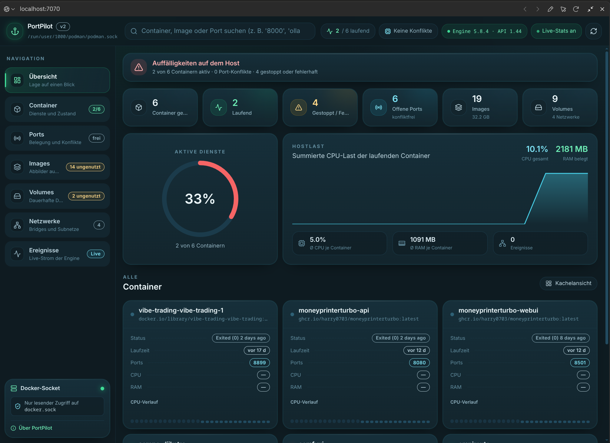
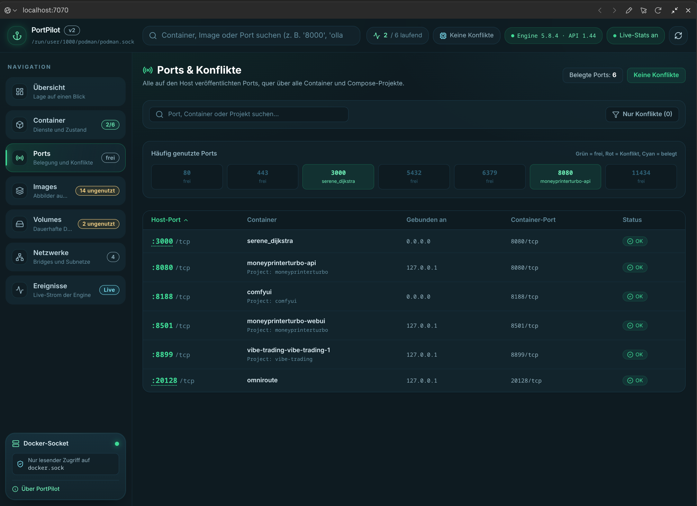
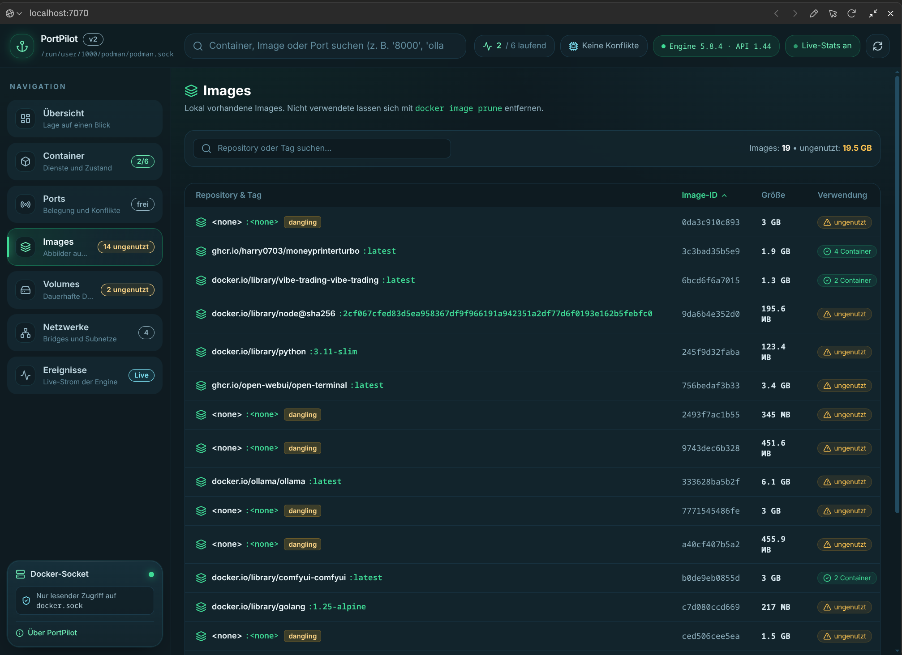

# PortPilot

Lokales Docker-Dashboard für Linux. Zeigt laufende Container, belegte Host-Ports,
Images, Volumes, Netzwerke und Engine-Ereignisse in Echtzeit — mit dem Schwerpunkt,
Port-Konflikte zu finden, bevor sie einen Start scheitern lassen.

**Nur lesend.** PortPilot startet, stoppt oder löscht nichts. Es gibt keine
Endpunkte, die etwas verändern.

## Oberfläche (V1.1)

**Übersicht** — Lagebericht, Kennzahlen-Boxen, Auslastungsring, Hostlast und
Container-Kacheln mit CPU-Verlauf:



**Ports & Konflikte** — alle veröffentlichten Host-Ports quer über alle Projekte,
inklusive Belegungsraster für die üblichen Verdächtigen:



**Images** — lokal vorhandene Abbilder mit Größe, Verwendung und `dangling`-Markierung:



## Kernfeatures

- **Übersicht** — Kennzahlen, Anteil aktiver Dienste, Hostlast, Container-Kacheln
- **Container** — Liste als Kachel- oder Tabellenansicht, nach Compose-Projekt gruppiert,
  Filter nach Status und Volltextsuche über Name, Image, Projekt und Port
- **Port-Konflikte** — alle veröffentlichten Host-Ports quer über alle Projekte,
  Konflikterkennung inklusive Wildcard-Bindungen, Raster der üblichen Ports
- **Detailfenster** je Container — Logs (ANSI-Steuerzeichen bereinigt, filterbar,
  als Datei speicherbar), Messwerte mit Verlauf, Umgebungsvariablen, Mounts, Netzwerke
- **Images, Volumes, Netzwerke** — sortierbare Tabellen mit Markierung für
  ungenutzte und `dangling`-Einträge
- **Ereignisse** — Live-Strom der Engine über Server-Sent Events, kein Polling
- **Handreichungen** — veröffentlichte Ports als Link in den Browser, Startbefehl
  gestoppter Container in die Zwischenablage
- Responsive Web-UI, ohne externe Dienste, alles lokal

**Was PortPilot nicht tut:** starten, stoppen, neu starten, löschen oder prunen.
Der Server stellt ausschließlich `GET`-Endpunkte bereit. Zum Steuern der Container
bleibt `docker` bzw. `docker compose` zuständig — den passenden Startbefehl legt
PortPilot dir auf Wunsch in die Zwischenablage.

## Neu in V1.4

- **Exakte Omarchy-Tokens, flach wie btop** — Rollen direkt aus der
  laufenden Shell (`btop.theme`, `shell.toml`, `Color.qml`): eine Fläche
  `#101913` überall (Boxen trennen nur 1px-Outlines in muted `#4a684a`),
  selected `#28302b`, Scrim `#101913` @50 %, keine Schatten, keine
  Verläufe. Kein Wallpaper im Browser — flach wie das Vorbild

## Neu in V1.3

- **Omarchy-Stil statt nur Omarchy-Farben** — flach, kantig, Terminal-nah wie
  btop & Co.: 1px-Borders, kleine Radien, keine Verläufe, keine Glows
- **Adaptiv statt eingefärbt** — die App liest das aktive Omarchy-Theme
  (`/api/theme` aus `colors.toml`) und folgt ihm automatisch (30-s-Takt plus
  sofort bei Fenster-Fokus). Fest wählbar im Über-Dialog; ohne Omarchy gelten
  die eingebauten Evergreen-Defaults. Endpunkte: `GET /api/theme[?name=…]`,
  `GET /api/themes` — wie alles andere nur lesend

## Neu in V1.2

- **Omarchy-Theme „Evergreen"** — Palette aus
  `~/.config/omarchy/themes/evergreen/colors.toml` (Akzent `#4a9a68`,
  Hintergrund `#080d0a`), JetBrains Mono für Code und Kennzahlen
- **Zweisprachig DE/EN** — 🇩🇪/🇬🇧-Umschalter in der Kopfzeile, Wahl wird in
  `localStorage` (`portpilot-lang`) gespeichert und gilt ohne Neuladen für
  die gesamte Oberfläche inklusive Status-Badges, Zeitangaben („vor 22 h" /
  „22h ago") und Port-Konfliktmeldungen

## Neu in V1.1

- **Neue Startseite „Übersicht"** — Lagebericht, sechs klickbare Kennzahlen-Boxen,
  Ring für den Anteil aktiver Dienste, Hostlast-Verlauf, Container-Kacheln
- **Neues Design** — Palette „Deep Harbor" (Tiefsee-Blau mit Grün/Cyan als Akzent),
  Karten mit Lichtsaum, Menuboxen mit Icon-Kachel und Statusbadge in der Navigation
- **Kopieren in die Zwischenablage repariert** — Fehler wurden bisher verschluckt und
  fälschlich als Erfolg angezeigt; jetzt mit Rückfallebene, Warnhinweis und
  automatischer Markierung des Befehls

---

## Voraussetzungen

| | |
|---|---|
| Node.js | 20 oder neuer (inklusive `npm`) |
| Docker | laufender Daemon, systemweit oder rootless — alternativ Podman über seinen Docker-kompatiblen Socket |
| Berechtigung | Lesezugriff auf den Docker-Socket |

Die Docker-CLI wird **nicht** benötigt — PortPilot spricht direkt mit dem Socket.
Ebenso wenig `curl`, `ss` oder `lsof`; alle Prüfungen laufen über Node.

Gruppenzugehörigkeit prüfen:

```bash
id -nG | tr ' ' '\n' | grep -x docker || echo "nicht in der Gruppe docker"
```

Falls nicht enthalten:

```bash
sudo usermod -aG docker "$USER"
```

Danach neu anmelden.

## Installation auf einer neuen Maschine

```bash
git clone https://github.com/kinski69/portpilot.git ~/portpilot
~/portpilot/bin/portpilot
```

Beim ersten Start installiert das Skript die Abhängigkeiten und baut die
Anwendung. Es zeigt die Container **der Maschine, auf der es läuft** — für
mehrere Rechner wird PortPilot auf jedem einzeln installiert.

Einen Eintrag im Anwendungsmenü legt `bin/install-desktop-entry` an — siehe
[In das Anwendungsmenü eintragen](#in-das-anwendungsmenü-eintragen).

Aktualisieren:

```bash
cd ~/portpilot && git pull && ./bin/portpilot
```

Der Rebuild erfolgt automatisch, sobald eine Quelldatei neuer ist als das
gebaute Bundle.

## Starten

```bash
./bin/portpilot
```

Das Skript installiert fehlende Abhängigkeiten, baut bei Bedarf neu, startet den
Server auf <http://127.0.0.1:7070> und öffnet den Browser. Läuft bereits eine
Instanz, wird nur das Fenster geöffnet.

Anderer Port:

```bash
PORTPILOT_PORT=7171 ./bin/portpilot
```

### Rootless Docker

Der Socket wird in dieser Reihenfolge gesucht: `DOCKER_SOCKET`, dann
`DOCKER_HOST` im Format `unix://…`, dann `$XDG_RUNTIME_DIR/docker.sock`
(rootless), zuletzt `/var/run/docker.sock`. In der Regel ist nichts zu
konfigurieren; andernfalls:

```bash
DOCKER_SOCKET="$XDG_RUNTIME_DIR/docker.sock" ./bin/portpilot
```

Funktioniert ebenso mit **Podman** über dessen Docker-kompatiblen Socket:

```bash
DOCKER_SOCKET="$XDG_RUNTIME_DIR/podman/podman.sock" ./bin/portpilot
```

## In das Anwendungsmenü eintragen

```bash
./bin/install-desktop-entry
```

Legt `~/.local/share/applications/portpilot.desktop` an — kein `sudo` nötig.
Entfernen mit `rm ~/.local/share/applications/portpilot.desktop`.

## Entwicklung

```bash
npm install
npm run dev
```

| Befehl | Zweck |
|---|---|
| `npm run dev` | Vite als Middleware im Express-Server, Hot Reload |
| `npm run build` | Frontend nach `dist/`, Server als `dist/server.cjs` |
| `npm start` | Produktionsmodus aus `dist/` |
| `npm run lint` | `tsc --noEmit`, strikt |

## Aufbau

```
Browser (React + Tailwind)
   │  fetch /api/…        Server-Sent Events /api/events
   ▼
Express (server.ts, server/routes.ts)
   │
   ▼
dockerode  ──►  /var/run/docker.sock  ──►  Docker Engine API
```

- `server/docker.ts` übersetzt die Engine-Antworten in die Typen aus `src/types.ts`.
  Die Oberfläche kennt die Docker-API nicht direkt.
- `src/hooks/useDockerData.ts` lädt die Ressourcen, abonniert den Event-Stream und
  pollt Messwerte im 3-Sekunden-Takt.
- Ereignisse werden gepusht, nicht abgefragt. Ein `docker run` erscheint sofort.

### Umgebungsvariablen

| Variable | Vorgabe | Zweck |
|---|---|---|
| `PORT` | `7070` | Port des Servers |
| `HOST` | `127.0.0.1` | Bind-Adresse. Bewusst lokal — der Prozess liest den Docker-Socket |
| `DOCKER_SOCKET` | automatisch | abweichender Socket, überschreibt die Suche |
| `DOCKER_HOST` | — | wird ausgewertet, sofern `unix://…` |
| `PORTPILOT_PORT` | `7070` | nur für `bin/portpilot` |

## Port-Konflikte

Ein Konflikt wird gemeldet, wenn **zwei verschiedene** Container denselben
Host-Port auf einer überlappenden Adresse binden. Bewusst *nicht* als Konflikt gewertet:

- derselbe Container mehrfach — Docker meldet IPv4 und IPv6 als getrennte Einträge
- gleicher Port auf nicht überlappenden Adressen, etwa `127.0.0.1:8000` und `192.168.1.5:8000`
- gleicher Port bei unterschiedlichem Protokoll — `tcp` und `udp` sind getrennte Namensräume

Eine Wildcard-Bindung (`0.0.0.0`) kollidiert dagegen mit jeder anderen Bindung auf
demselben Port.

## Grenzen

- **Volume-Größen** bleiben meist leer. Die Engine liefert sie nur über einen teuren
  `df`-Aufruf; ohne diese Angabe steht dort `—` statt eines erfundenen Werts.
- **Logs** werden alle 5 Sekunden nachgeladen, nicht als Dauerstream. Messwerte
  laufen im 3-Sekunden-Takt und lassen sich in der Kopfzeile pausieren.
- **Keine Schreibaktionen.** Container steuern weiterhin über `docker` oder `docker compose`.
- **Ein Host je Instanz.** PortPilot zeigt den Rechner, auf dem es läuft — kein
  Sammel-Dashboard über mehrere Maschinen.

## Lizenz

Apache-2.0
